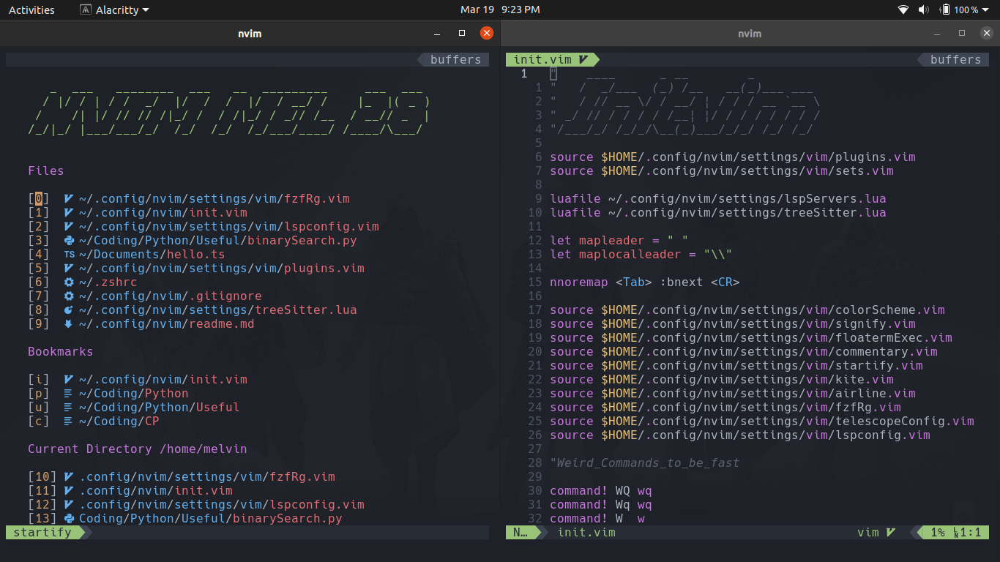

# NVIM

> This is my current Neovim (0.5) config in Ubuntu 20.04.2. Issues and doubts are welcome!

---

---

### Table of Contents

- [Description](#description)
- [Best Editor Ever](#Why-is-nvim---the-best-editor-ever)
- [How To Use](#how-to-use)
- [Installation](#Installation-:)
- [References](#references-:)
- [License](#license)
- [Author Info](#author-info)

---

## Description

Neovim is a fork of Vim with additional features, striving to improve the extensibility and maintainability of Vim. It provides better scripting, plugins, and integration with modern GUIs with almost all of Vim's features.

I've built my Neovim config from scratch with the help of many resources and people (Special Thanks to **The Primeagen & Chris@machine**), which took me more than 30hrs to build.


#### **Main Technologies:**

- Vimscript 
- Lua

---

## Why is NVIM - **The Best Editor Ever!**

- Free and Open Source
- Very Well Documented
- Vibrant Community
- Highly Portable, Customizable, Extensible
- Supports all Languages and Formats
- Uses Less Of System's Resources
- Fastest Editing Power
- Much Needed For Linux based Systems and Servers

[Back To The Top](#NVIM)

---

## How To Use

There are no install scripts for the config as of now, so I'll reference the necessary pages and steps. Do go through the references on your own caus e learning Vim on your own is such a great experience. Live Long and Prosper!

### **Installation :**
- The following steps are for Ubuntu and similar OS, Please use the necessary alternatives if your OS is different :)

```bash
    sudo apt update

    sudo apt install git fzf universal-ctags silversearcher-ag fd-find nodejs curl wget

    sudo apt install npm clangd-9 snapd

    sudo update-alternatives --install /usr/bin/clangd clangd /usr/bin/clangd-9 100

    npm i -g pyright
    npm i -g typescript typescript-language-server

    sudo snap install nvim --beta --classic

```
- [Install](https://www.kite.com/download/) Kite (AI Coding Assistant) for A.I Auto-completions!
- Start your Vim journey with the legendary **The Primeagen!** 
- [Link](https://youtu.be/DogKdiRx7ls) to make your first Vim config :)  
---
[Back To The Top](#NVIM)

### **References:**

- [Why is learning Vim so useful](https://youtu.be/6GOqCU2VA0g)

- [Learn Vim from The Primeagen](https://youtube.com/playlist?list=PLm323Lc7iSW_wuxqmKx_xxNtJC_hJbQ7R)

- [Create and Modify your Neovim config](https://youtube.com/playlist?list=PLhoH5vyxr6QqPtKMp03pcJd_Vg8FZ0rtg)

- [The best Neovim blog](https://www.chrisatmachine.com/neovim)

- [Neovim-GitHub](https://github.com/neovim/neovim)

- [Neovim-LSP](https://github.com/neovim/nvim-lspconfig/)

---


## **License**

MIT License

Copyright (c) 2021 Melvin Jebasamuel

Permission is hereby granted, free of charge, to any person obtaining a copy
of this software and associated documentation files (the "Software"), to deal
in the Software without restriction, including without limitation the rights
to use, copy, modify, merge, publish, distribute, sublicense, and/or sell
copies of the Software, and to permit persons to whom the Software is
furnished to do so, subject to the following conditions:

The above copyright notice and this permission notice shall be included in all
copies or substantial portions of the Software.

THE SOFTWARE IS PROVIDED "AS IS", WITHOUT WARRANTY OF ANY KIND, EXPRESS OR
IMPLIED, INCLUDING BUT NOT LIMITED TO THE WARRANTIES OF MERCHANTABILITY,
FITNESS FOR A PARTICULAR PURPOSE AND NONINFRINGEMENT. IN NO EVENT SHALL THE
AUTHORS OR COPYRIGHT HOLDERS BE LIABLE FOR ANY CLAIM, DAMAGES OR OTHER
LIABILITY, WHETHER IN AN ACTION OF CONTRACT, TORT OR OTHERWISE, ARISING FROM,
OUT OF OR IN CONNECTION WITH THE SOFTWARE OR THE USE OR OTHER DEALINGS IN THE
SOFTWARE.


---

## Author Info

I'm Melvin a freshman in India, trying to become a great Software Developer and Competitive Programmer.

- [Mail](mailto:jebasamuel@gmail.com)

[Back To The Top](#NVIM)
